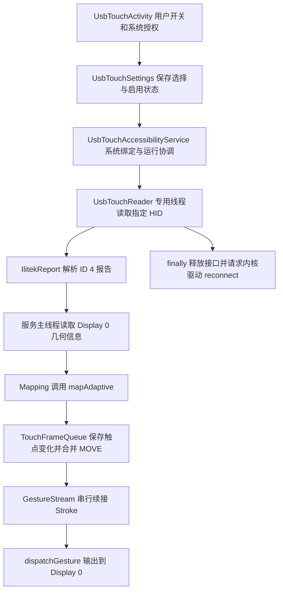
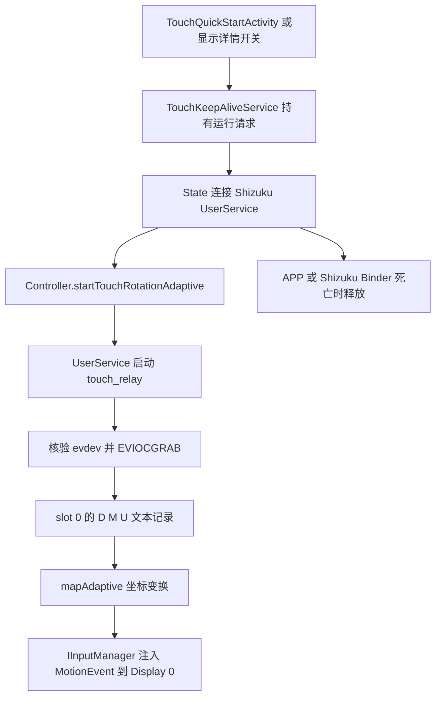

# 安卓屏连触控修正版开发指南

本文用于接手开发、定位功能以及评估局部修改的影响范围。说明基于 `codex/touchfix-usb` 分支的 `356f90d` 源码，整理日期为 2026-10-07。后续实现变化时，应同步更新相关章节和验收记录。

当前应用版本为 **43 / `1.3.3-touchfix.11-usb`**，安装包名为 `com.gitee.connect_screen.touchfix`，Java namespace 仍为 `com.gitee.connect_screen`。本次开发在原安卓屏连项目中增加触控修复，两种实现共存；原有投屏、DisplayLink、屏幕设置、模拟熄屏和 X11 功能仍在同一个工程内。

## 目录

- [1. 接手时先确认什么](#1-接手时先确认什么)
- [2. 从干净检出开始构建](#2-从干净检出开始构建)
- [3. 工程与功能定位](#3-工程与功能定位)
- [4. 两条触控数据流](#4-两条触控数据流)
- [5. 协议和坐标约定](#5-协议和坐标约定)
- [6. 状态、线程和资源所有权](#6-状态线程和资源所有权)
- [7. 按修改目标选择入口](#7-按修改目标选择入口)
- [8. 验证与故障定位](#8-验证与故障定位)
- [9. 打包、签名和回退](#9-打包签名和回退)
- [10. 后续开发优先级与交接模板](#10-后续开发优先级与交接模板)

## 1. 接手时先确认什么

| 项目 | 当前基线 | 对继续开发的影响 |
| --- | --- | --- |
| USB + 无障碍模式 | 普通应用 UID 读取指定 ILITEK HID，再输出到手机 Display 0 | 已有有效映射时，运行不依赖 Shizuku、ADB 或 root |
| Shizuku 模式 | shell UserService 启动独立 relay，读取 evdev 并注入 Display 0 | 依赖 Shizuku 授权以及 `/data/local/tmp/touch_relay` |
| 标定入口 | 五点标定仍调用 Shizuku UserService | 新手机尚不能仅凭 USB 模式独立完成完整标定 |
| 触点能力 | USB 解析最多 10 个触点；旧 relay 只读取 slot 0 | 协议能力、合成输出检查、物理多指验收是不同层次 |
| 已有设备记录 | Mate 30 上物理点击、拖动通过；用户反馈真实重启后使用正常 | 不能推出所有 ROM、屏幕或无人操作重启恢复都已通过 |
| OPPO 记录 | Reno8 / Android 14 的旧 Shizuku 交付记录 | 尚无该机完整物理触控与 USB 模式兼容性验收 |
| 完整 Windows 打包器 | 保留了 `.10` 的 OPPO/Shizuku 分发假设 | 当前 `.11-usb` 不应直接按已适配的完整分发工具使用 |

阅读顺序：先读本文，再按需求读 [USB 模式与实测记录](USB_TOUCHFIX_ZH.md)、[旧 Shizuku 分发说明](TOUCHFIX_PROJECT.md)、[native relay 说明](../native/README.md) 和 [设备历史](../native/VALIDATION.md)。实测文档里的 `diagnostics/` 路径指原开发机本地证据，仓库不携带这些设备日志；接手者需要在自己的设备上重新采集。

## 2. 从干净检出开始构建

### 2.1 工具与版本

| 工具 | 仓库配置 / 需要准备的内容 |
| --- | --- |
| JDK | 17，配置 `JAVA_HOME` |
| Gradle | 使用仓库 wrapper，版本 8.7；不要先切换到系统 Gradle |
| Android Gradle Plugin | `gradle/libs.versions.toml` 中为 8.6.0 |
| Kotlin | 1.9.0；app Compose compiler 配置为 1.5.1 |
| Android SDK | platforms `android-28`、`android-34`，build-tools `36.1.0`，platform-tools |
| app SDK | minSdk 29、compileSdk 34、targetSdk 34 |
| native 编译 | WSL/Linux + Zig；USB 库脚本当前固定调用 `/usr/sbin/zig` |
| 测试设备 | 优先使用当前已验证的 `222a:0001` ILITEK 触屏；其他设备按新适配处理 |

`android-28` 用于 shell-loader 模块，`android-34` 用于主工程和库模块。不要只安装一个 platform 后把全部模块的 compileSdk 改成同一个值来绕过构建失败。

### 2.2 检出与本机设置

在 PowerShell 中执行，路径示例请替换成本机实际位置：

```powershell
git clone --branch codex/touchfix-usb https://github.com/candle233/connect-screen.git
Set-Location connect-screen
git submodule update --init --recursive

$env:JAVA_HOME = 'C:\Dev\jdk-17'
'sdk.dir=C:/Dev/Android/Sdk' | Set-Content -Encoding ASCII local.properties
.\gradlew.bat :app:assembleDebug :app:testDebugUnitTest
```

首次构建需要获取 wrapper 和 Maven 依赖；只有依赖已经缓存时才加 `--offline`。Android Studio 打开仓库根目录，Gradle JDK 同样选 17。`local.properties`、本机 SDK/JDK 路径和签名文件不提交。

仓库包含 `connect-screen.com`、`termux-x11` 两个 Git submodule；当前 Android 模块清单由 [settings.gradle](../settings.gradle) 决定。修改官网或上游 X11 子仓库时，应分别管理其提交，不能把根仓库的 submodule 指针更新误当成已经上传了子仓库代码。

shell-loader 的 Gradle 配置阶段会读取 app 的 debug keystore。若干净机器报 debug.keystore 不存在，应先准备 Android 调试签名环境；必要时可生成标准本机调试证书：

```powershell
New-Item -ItemType Directory -Force "$env:USERPROFILE\.android" | Out-Null
& "$env:JAVA_HOME\bin\keytool.exe" -genkeypair -v `
  -keystore "$env:USERPROFILE\.android\debug.keystore" `
  -storepass android -alias androiddebugkey -keypass android `
  -dname 'CN=Android Debug,O=Android,C=US' -keyalg RSA -keysize 2048 -validity 10000
```

仅在文件不存在时运行生成命令。新证书不能覆盖安装由另一张证书签名的旧 APK，详见第 9 节。

### 2.3 产物与 native 的区别

普通 Java、资源、Manifest 修改：

```powershell
.\gradlew.bat :app:assembleDebug :app:testDebugUnitTest
```

APK 位于 `app/build/outputs/apk/debug/app-debug.apk`，JUnit 报告位于 `app/build/test-results/testDebugUnitTest/`，HTML 报告位于 `app/build/reports/tests/testDebugUnitTest/index.html`。

USB JNI 释放库修改：

```powershell
powershell.exe -NoProfile -ExecutionPolicy Bypass -File .\tools\Build-UsbTouchDriver.ps1
.\gradlew.bat :app:assembleDebug :app:testDebugUnitTest
```

该脚本分别编译 `arm64-v8a` 和 `armeabi-v7a` 的 `libtouchusb.so` 到 `app/src/main/jniLibs/`。这两个文件随源码追踪并由 Gradle 打入 APK；**Gradle 不会自动从 C 源码重建它们**。脚本里的 Zig 路径不是本机路径时先适配脚本。

旧 Shizuku relay 修改，在仓库根目录执行：

```powershell
wsl.exe --exec sh native/build.sh
```

`native/build.sh` 依赖 WSL 的当前目录对应仓库；必要时用 `wsl.exe --cd` 明确目录。脚本优先使用 PATH 中的 Zig，否则使用带完整 libc sysroot 的 AArch64 GCC，产物为 `native/bin/touch_relay`。这个可执行文件不在 APK 内，也不进入 Git；修改后必须单独部署。

## 3. 工程与功能定位

下面以源码链接作为修改入口。应用 Java 根目录统一为 `app/src/main/java/com/gitee/connect_screen/`。

| 位置 | 责任 | 修改时的关联点 |
| --- | --- | --- |
| [app](../app/build.gradle) | 主 APK、版本号、安装包名、依赖、资源 | Manifest、authority、签名、安装脚本 |
| [hidden-api-stub](../hidden-api-stub/build.gradle) | 隐藏 Android API 的编译期声明 / Refine | 系统接口签名和 ROM 差异；不是系统服务实现 |
| [termux-x11-app](../termux-x11-app/build.gradle) | X11 Java UI、输入和生成配置 | `generatePrefs` 从 XML 生成 Java，不手改 build 下产物 |
| [termux-x11-shell-loader](../termux-x11-shell-loader/build.gradle) | shell 入口、目标包与签名校验配置 | 当前目标 `APPLICATION_ID` 仍写为 `com.gitee.connect_screen`，不要假设已适配 touchfix 包 |
| [MainActivity](../app/src/main/java/com/gitee/connect_screen/MainActivity.java)、[State](../app/src/main/java/com/gitee/connect_screen/State.java) | 主界面、Job 调度、Shizuku UserService 连接 | Activity 销毁不能随意解绑仍被常驻服务使用的连接 |
| [DisplayDetailFragment](../app/src/main/java/com/gitee/connect_screen/DisplayDetailFragment.java) | 显示详情、触控开关、调试、标定和恢复入口 | Controller、TestActivity、RotationDialog |
| [RotationDialog](../app/src/main/java/com/gitee/connect_screen/dialog/RotationDialog.java)、[ChangeRotation](../app/src/main/java/com/gitee/connect_screen/job/ChangeRotation.java) | 请求屏幕画面旋转 | 系统操作成功后才通知触控映射更新 |
| [TouchRotationController](../app/src/main/java/com/gitee/connect_screen/TouchRotationController.java) | 保存画面方向、映射、标定；分流两种模式 | 两条输出链路共用它的配置，不复制第二套标定 |
| [TouchRotationTransform](../app/src/main/java/com/gitee/connect_screen/shizuku/TouchRotationTransform.java)、[TouchAffineCalibration](../app/src/main/java/com/gitee/connect_screen/shizuku/TouchAffineCalibration.java) | 纯 Java 坐标变换、最小二乘拟合、RMSE | 两种模式共用；改算法需运行坐标和标定测试 |
| [usbtouch](../app/src/main/java/com/gitee/connect_screen/usbtouch/) | USB 模式完整运行链路 | 详见第 4～6 节 |
| [UserService](../app/src/main/java/com/gitee/connect_screen/shizuku/UserService.java)、[IUserService.aidl](../app/src/main/aidl/com/gitee/connect_screen/shizuku/IUserService.aidl) | shell 权限下事件注入、relay 管理；也承担旧熄屏功能 | 修改 AIDL 保持已有 transaction ID，新增方法使用未占用 ID |
| [TouchKeepAliveService](../app/src/main/java/com/gitee/connect_screen/TouchKeepAliveService.java)、[TouchBootReceiver](../app/src/main/java/com/gitee/connect_screen/TouchBootReceiver.java) | 旧模式常驻、异常暂停和开机恢复 | USB 模式选择后跳过旧启动路径 |
| [TouchQuickStartActivity](../app/src/main/java/com/gitee/connect_screen/TouchQuickStartActivity.java) | “开启触控修正”桌面入口 | USB 已选择时转到 USB 页面；旧模式重复点击不关闭运行实例 |
| [TouchRotationTestActivity](../app/src/main/java/com/gitee/connect_screen/TouchRotationTestActivity.java) | 空白测试画布、事件计数、五点采集、合成输出检查 | 标定与手动测试使用不同证据类型 |
| [native/touch_relay.c](../native/touch_relay.c) | 旧 evdev 读取、设备核验、独占和释放 | READY 握手、D/M/U 协议、slot 0 |
| [native/usb_touch_guard.c](../native/usb_touch_guard.c)、[UsbDriver](../app/src/main/java/com/gitee/connect_screen/usbtouch/UsbDriver.java) | 已授权 USB fd 的驱动 reconnect JNI | JNI 符号名、CPU ABI、ioctl 布局 |
| [deployment](../deployment/)、[tools](../tools/) | 安装模板、检查、模拟 ADB 测试、构建与打包工具 | 分发目录、版本、哈希、源码白名单 |
| [experiments/usb-touch-probe](../experiments/usb-touch-probe/) | 独立 USB 诊断 APK、HID 描述符与原始报告分析 | 不是主应用驱动；build.ps1 尚有原开发机固定路径 |
| [shizuku-autostart](../shizuku-autostart/)、[WirelessShizukuBootstrap](../app/src/main/java/com/gitee/connect_screen/WirelessShizukuBootstrap.java) | Windows 启动 Shizuku / 手机本地实验 bootstrap | 两种实现不同，不能作为 USB 模式的依赖 |

原项目其他功能的入口：

| 要修改的功能 | 先读的文件 |
| --- | --- |
| 分辨率、DPI | `dialog/ResolutionDialog.java`、`dialog/DpiDialog.java`、`job/ChangeResolution.java`、`job/ChangeDPI.java` |
| 镜像投屏 | `MirrorMainActivity.java`、`MirrorActivity.java`、`MediaProjectionService.java`、`job/ProjectViaMirror.java` |
| DisplayLink | `DisplaylinkFragment.java`、`DisplaylinkState.java`、`DisplaylinkPref.java`、`job/ProjectViaDisplaylink.java`、`com/displaylink/` |
| 输入设备绑定到屏幕 | `InputDeviceDetailFragment.java`、`job/BindInputToDisplay.java`、`job/BindAllExternalInputToDisplay.java`、`job/InputRouting.java` |
| 模拟熄屏 / 音量键退出 | `PureBlackActivity.java`、`UserService.setScreenPower()`、`startListenVolumeKey()`、`stopListenVolumeKey()` |
| 手机虚拟触摸板 | `TouchpadActivity.java`、`TouchpadAccessibilityService.java`；与 USB 触控服务分别维护 |
| X11 入口 | `LaunchX11Receiver.java`、`termux-x11-app/`、`termux-x11-shell-loader/` |

上述旧功能是定位入口，当前 20 项触控单元测试没有覆盖这些功能的完整行为。局部修改后须验收该功能自身。

## 4. 两条触控数据流

### 4.1 USB + 无障碍模式



运行顺序：

1. 用户启用同名无障碍服务并同意 Android USB 授权。`UsbTouchActivity` 开关开启前检查映射并请求停止旧链路。
2. `UsbTouchSettings.setEnabled()` 保存 `selected=true`、启用状态，并触发服务 `refresh()`。
3. 服务 `onServiceConnected()` 建立通知频道，记录当前 UID / 开机编号，每秒运行一次 `tick()`。页面关闭后由服务继续协调运行。
4. `tick()` 检查开关、解锁状态、目标设备、权限和映射。权限缺失时等待用户操作；映射无效时不接管 USB。
5. `UsbTouchReader` 加载 JNI 库，核验设备、接口、端点，再 `claimInterface(..., true)`。读取并核验 HID 描述符后才报告 ready。
6. 每个报告通过主线程回调进行坐标变换、排队和手势输出。旋转 / 尺寸变化时结束当前手势并抑制输入，等待物理抬手后接受新手势。
7. 关闭、断连、锁屏或服务解绑请求停止 reader；reader 的 `finally` 负责取消请求、释放接口、reconnect 和关闭连接。

USB 读取本身不需要 Shizuku。但是首次保存画面方向、当前五点标定、原项目的强制画面旋转功能仍可能使用 Shizuku。不要将“运行不依赖”写成“新机所有设置都不依赖”。

### 4.2 Shizuku + evdev 模式



`UserService` 启动时要求 APP token 和实际 Shizuku token 存活；只附加 token 不代表请求接管触屏。relay 在 stderr 上发送 `READY grabbed ...`，Java 等待最多 3 秒，stdout 单独承载触点数据。

shell 服务每 100 ms 读取手机 Display 0 的逻辑尺寸和 rotation。变化时发送取消事件并更新几何信息，保持原始屏幕映射参考。`stopTouchRotation()` 终止并等待 relay、取消手势、清理线程；崩溃处理和 Binder death guard 同样请求释放。

旧模式异常退出会设置暂停状态，避免监督服务将用户紧急停止误认为自动恢复请求。Shizuku 连接丢失则先释放，等待重新连接。

## 5. 协议和坐标约定

### 5.1 USB 设备核验

[UsbTouchReader](../app/src/main/java/com/gitee/connect_screen/usbtouch/UsbTouchReader.java) 当前要求以下条件全部符合：

| 条件 | 当前值 |
| --- | --- |
| vendor / product | `0x222a / 0x0001`，XML 对应十进制 `8746 / 1` |
| manufacturer / product name | `ILITEK / ILITEK-TP` |
| interface | 恰好 1 个接口，接口 ID 为 0，class 为 HID |
| endpoint | interrupt IN，地址 `0x81`，max packet size 64 |
| HID report descriptor | 长度 850，SHA-256 等于 `IlitekReport.DESCRIPTOR_SHA256` |

[ilitek_touch_device.xml](../app/src/main/res/xml/ilitek_touch_device.xml) 控制系统 USB attach 入口过滤，但不替代 reader 的核验。`find()` 目前返回首个匹配设备；多块同型号屏同时连接尚无明确的设备选择流程。

### 5.2 当前 ILITEK 报告布局

[IlitekReport.decode()](../app/src/main/java/com/gitee/connect_screen/usbtouch/IlitekReport.java) 的约定：

- 触控 report ID 为 4，长度必须为 64 字节；其他 ID 返回 `null`，不按触控格式解释。
- 第 55 字节保存记录数量，最多 10；第 `1 + i * 5` 字节开始每个触点记录。
- 每条记录第 1 字节低 6 位是 contact ID，bit 6 是 tip / down 位。
- 后 4 字节分别为 X、Y 的小端 16 位值，接受范围为 `0..16384`。
- contact count 包含抬起记录，因此 `count=1, tip=0` 是有效 UP。
- 重复 contact ID、越界坐标、未声明的 down 触点、截短 ID 4 报告均抛错并进入释放流程。

适配另一块触屏时，应建立独立协议与身份配置，保存新描述符及分析结果；仅改 VID/PID 或移除 hash 校验不足以实现兼容。

### 5.3 画面方向、映射方向、手机方向

有三个不同量：

1. **visual rotation**：应用成功请求的投屏画面方向，在 preferences 中按度数保存。
2. **touch mapping rotation**：从外接屏 raw 坐标到参考手机画面的映射，以 `0..3` 表示四分之一周。
3. **phone rotation**：当前手机 Display 0 坐标系的方向，与标定参考方向比较后参与组合变换。

不能直接认为 visual 270 就应使用 mapping 3。已有 Mate 30 标定记录里，visual 270 使用 mapping 1 加仿射校正；无测量配置时 270 默认返回 `-1`，拒绝开启。

`mapAdaptive()` 先执行参考映射，再补偿手机坐标系变化，最后缩放和裁剪到当前显示区域。有仿射系数时，仿射结果替代默认 raw 四向公式，并不再额外叠加该默认旋转：

```text
无仿射：u = rawX / 16384，v = rawY / 16384
rotation 0 -> (u, v)
rotation 1 -> (v, 1-u)
rotation 2 -> (1-u, 1-v)
rotation 3 -> (1-v, u)

有仿射：referenceX = a*rawX + b*rawY + c
        referenceY = d*rawX + e*rawY + f
        归一化时分别除以 referenceWidth、referenceHeight

phoneDelta = (phoneRotation - referencePhoneRotation + 4) % 4
补偿 phoneDelta 后，乘当前 width / height
裁剪至 [0,width-1] × [0,height-1]
```

基准目标是手机 Display 0，而不是外接独立桌面。外接显示器 InputReader viewport orientation 不用于覆盖保存的 visual 状态。坐标修复不会自行旋转投屏图像。

### 5.4 标定与配置保存

五点画布采集 `[rawX, rawY, targetX, targetY]`，通过 `TouchAffineCalibration.fit()` 计算六个系数，输出 RMSE，使用 `nearestQuarterTurn()` 推断近似映射方向。拟合至少要求三个有效、非共线点；界面流程采集五点。

当前 `TouchRotationTestActivity` 通过 `State.userService.getLastTouchDownRaw()` 获取原始按下，并用注入事件时间匹配。`saveCalibration()` 再查询 shell 服务的参考几何信息并保存。因此 USB 模式复用旧标定，但尚没有从自己的 reader 直接完成五点标定的通路。

## 6. 状态、线程和资源所有权

### 6.1 两个 preferences 文件

| 文件 / key | 内容 | 修改约束 |
| --- | --- | --- |
| `touch_rotation.xml` / `touch_rotation_visual` | 画面度数，`-1` 表示未选择 / 不强制 | 读取接口返回 `0..3`；不要混用度数与枚举 |
| `touch_rotation_mapping_<度数>` | 对应画面角度的 raw 映射方向 `0..3` | 与 affine、参考帧一起保存 |
| `touch_rotation_affine_<度数>` | 六个系数的 JSON 数组 | 保持顺序 `[a,b,c,d,e,f]` 和有限值检查 |
| `touch_rotation_reference_width/height/phone_<度数>` | 标定时手机参考尺寸 / rotation | 换方向或分辨率不应直接重写参考帧 |
| `touch_rotation_samples_<度数>` | raw / target 采样 JSON | 旧模式部分方向会用采样重新推断映射 |
| `touch_rotation_enabled`、`touch_rotation_keep_alive` | 旧模式自动跟随 / 常驻请求 | 不是 USB 实际运行状态 |
| `touch_rotation_fault_paused` | 旧模式故障暂停 | 明确用户重新开启后才能清除 |
| `touch_rotation_boot_enabled` | 旧模式开机尝试，默认 true | USB selected 时 BootReceiver 不走旧启动 |
| `touch_rotation_wireless_bootstrap` | 手机本地实验 Shizuku 启动，默认 false | 与 Windows 计划任务独立 |
| `usb_touch.xml` / `usb_touch_selected` | 用户选择 USB 模式 | 即使开关关闭，也保留模式选择 |
| `usb_touch_enabled` | USB 模式启用请求 | 故障时写 false，不把它当成 reader 已 ready |
| `status`、`last_error` | USB 状态文字 / 最近错误 | 再次开启会清理 last_error |
| `service_boot/uid/started`、`capture_boot/uid/started/stopped` | 服务 / 采集的开机、身份、时间证据 | 判断是否本次运行；不能只看历史计数 |
| `reports`、`gesture_segments`、`cancelled_gestures`、`reconnect_result` | USB 读取 / 输出 / 释放指标 | 会在运行周期更新或覆盖，不是长期累计统计 |
| `test_*`、`output_check_*` | 画布及合成输出检查结果 | 区分人工物理测试与 scripted output |

旧标定缺参考帧时默认 `1080×1920 / phoneRotation 0`；这是历史兼容默认值，不是任意手机正确配置。调整 key 或格式时需提供旧数据迁移，并验证升级安装保留已有校准。

### 6.2 USB 生命周期

| 场景 | 当前处理 | 开发时保留的行为 |
| --- | --- | --- |
| 开关关闭 | 请求停止 reader、结束手势，finally 释放接口 | 不继续吞掉外接屏原生输入 |
| 缺 USB 权限 | 等待 Activity 的系统授权 | 服务不自行绕过授权、不循环弹窗 |
| 锁屏 / 非 interactive | 每秒监督时请求停止 | 解锁后按保存开关尝试恢复 |
| 插拔 / 更换设备节点 | 停止旧 reader，重新查找 | 不依赖保存的 USB deviceName |
| 手机显示几何变化 | `endAndSuppress()` | 等待物理所有触点抬起后开始新手势 |
| 输出取消 | 清队列、清手势，抑制到抬手 | 手机自身物理输入可能有意打断，不立即重放 |
| 输出拒绝 / 超时 | 故障停止；输出 fault 路径调用 `disableSelf()` | 避免残留注入指针，重新启用服务后再验收 |
| 协议 / 映射异常 | `fail()` 保存错误并关开关 | reader 释放后不自动无条件重试错误协议 |
| 切回 Shizuku | 关闭 USB selected/enabled，UI 延迟 1 秒打开旧入口 | 该延迟不是严格释放确认；应改成确认后交接 |

reader 工作在专用线程；服务、队列和 `GestureStream` 操作通过主线程 Handler 串行处理。修改回调线程时不能直接让 reader 并发操作这些集合。

`TouchFrameQueue` 上限 64 帧，只合并连续、活动 contact ID 集相同的 MOVE，保留 DOWN/UP 及触点变化。该限制只约束手势帧队列；reader 每个报告先 `main.post()`，**主线程待执行 Runnable 并没有同样的显式上限**。后续吞吐优化应同时考虑这层积压。

`GestureStream` 一次只允许一个 dispatch 在途；16 ms 片段通过 `continueStroke()` 延续，1500 ms 等待超时触发故障。续接位置先四舍五入到像素，以保持上一个终点和下一个起点一致。Android 12 的已记录实现会拒绝没有位移和触点变化的空续接；当前选择等待真实变化。新加入手指在旧指续接初始点之后 1 ms 加入。

关闭 reader 是异步请求，正常空闲读取以 500 ms timeout 检查 stopping；不要在 UI 线程 `join()` 读线程。`UsbDriver.reconnect()` 返回值中，`-16` 为 EBUSY（当前设备实测表示已绑定），`-19` 为 ENODEV（物理拔出可预期）；其他异常由服务提示重插。

## 7. 按修改目标选择入口

### 7.1 改界面文案、按钮、通知或桌面入口

先读 `UsbTouchActivity`、`UsbTouchAccessibilityService.notification()`、`TouchQuickStartActivity`、Manifest 和 `res/values/strings.xml`。USB 页面目前使用 Java 动态创建控件，很多文案直接写在 Java，修改 XML 字符串不一定会改变界面。页面渲染有 `rendering` guard，避免刷新开关时误触启停监听；保留它。

修改 launcher 标签还需检查 Manifest 中两处 Activity 与无障碍 service 的 label。调整入口后验收首次授权、重复点击、从设置返回、USB attach 拉起，以及开关关闭时不会自动启用。此类修改通常无需改 HID / native。

### 7.2 改触摸偏移、缩放、旋转或校准

先确认问题是投屏画面方向、raw 坐标协议，还是手机显示坐标系，再改 `TouchRotationTransform`、`TouchAffineCalibration` 或 Controller。不要在手势输出末端加固定偏移掩盖参考帧错误。

改数学层时补充覆盖实际失败输入的断言，运行三套坐标 / 标定测试及全部测试，并在四角、中心、拖动、手机横竖变化时比较实际落点。USB 与 Shizuku 共用数学层，两种模式都需要验证。只针对一条链路的补偿不要放入公共算法。

### 7.3 让新手机完全不依赖 Shizuku 标定

这是新增能力，当前尚未实现。建议路径：

1. 在 USB reader → 服务之间提供带 contact ID 和单调时间戳的原始采样会话，限定于明确进入的标定页面。
2. 让 `TouchRotationTestActivity` 可选择 USB 原始采样来源，不再直接假定 `State.userService` 存在。
3. 将存储参考几何信息与“启动 shell 输出”从 `saveCalibration()` 中拆开，使纯 USB 标定能保存同格式配置。
4. 保持五点目标和 raw DOWN 的匹配规则，拒绝多指、超时、跨显示几何变化的无效采样，显示拟合误差。
5. 在清空旧配置的新测试安装上完成 USB 授权、标定、点击拖动和回退；不能拿原机已有校准证明首次设置成功。

若同时需要无 Shizuku 的画面方向设置，应另行确认普通应用能控制的范围；当前 `ChangeRotation` 仍通过系统隐藏接口和 Shizuku 执行。

### 7.4 增加另一型号触屏

先用独立 probe 采集设备身份、接口、端点、HID 描述符和 raw 报告，确认关闭后恢复原输入。新增描述符分析 / decoder，而不是只放宽当前 reader。修改涉及设备 XML、匹配和唯一选择策略、decode、raw range、映射归一化、单元测试及实机验证。

当前公共算法将 raw 最大值固定为 16384；新设备量程不同，需要通过明确的协议配置传递，不能只改 decoder 的越界判断。多个相同 VID/PID 设备连接时也要定义选择行为。

### 7.5 改多指、长按或触控延迟

先读 `GestureStream`、`TouchFrameQueue` 和两套 USB 测试。保留 contact ID、UP、旧指续接起点和“手机输入取消后等待抬手”的规则。改变 16 ms 分段、队列容量或主线程回调策略时，记录 reports、完成片段、取消、耗时和内存，不只凭主观顺滑感判断。

已有双指合成检查不是物理长按 / 多指验收。测试应包含第二指加入 / 独立抬起、静止长按后移动、连续点击、手机同时触摸、慢输出、旋转中按住、关闭中按住和断连。旧 relay 多指是另一项开发：需要扩展 evdev slot 跟踪、D/M/U 协议和 MotionEvent pointer 构造，不能直接复用目前的单指文本协议。

### 7.6 改开机恢复、后台持续运行或模式切换

USB 模式读 `UsbTouchSettings`、`UsbTouchAccessibilityService.tick()`、Manifest、USB attach 入口；旧模式读 `TouchKeepAliveService`、`TouchBootReceiver`、State 连接管理。无障碍服务由 Android 在用户启用后绑定；BootReceiver 的 `refresh()` 不能替代系统绑定，也不能绕过 force-stop。

模式切换应遵循“停止旧 owner → 确认释放 → 启动新 owner”。当前 USB → Shizuku 的固定 1 秒延迟值得改成显式确认；Shizuku → USB 停服务与释放流程也需要检查并发交接。验收清最近任务、锁屏解锁、杀进程、关闭服务、插拔、重启以及开关明确关闭后的行为。

### 7.7 改投屏旋转、分辨率或输入设备路由

画面旋转从 `RotationDialog → ChangeRotation` 开始；只有系统旋转成功才触发 `onVisualRotationApplied()`，不能在 Spinner 选项变化时先改变触控保存状态。设置“不强制”必须释放触控，即使系统画面恢复失败也要尝试停止。

分辨率 / DPI 与显示几何变化相关，需要验证映射保持参考标定且缩放到当前 Display 0。`InputRouting` 的系统设备到 display 绑定是原项目另一条路由能力；USB 模式接管后 HID 可能暂时不再作为内核输入设备出现，不能通过随意改路由来修复其 reader 输出。

若要输出到外接独立 Display，应同时修改 UserService 的 `displayId != 0` 限制、几何查询、GestureStream 的 `setDisplayId(0)`、配置选择和标定目标，并验证目标 display 的运行时有效性；只改一个数字会导致坐标系不一致。

### 7.8 改 JNI、包名、AIDL 或版本

JNI Java 类 / 包名变化时要同步修改 `Java_com_gitee_connect_1screen_usbtouch_UsbDriver_reconnect` 导出符号并重新编译两个 ABI。native guard 只在现有授权 fd 上调用 reconnect，不增加扫描或开设备职责。

安装包名变化需要检查 Manifest authority、action 字符串、部署脚本固定包名、快捷方式、shell-loader 目标与签名、`run-as` 证据脚本。namespace 与 applicationId 不同是当前有意配置；不要用全仓库替换包名来修改安装 ID。

AIDL 方法有显式 transaction ID，保留既有编号与参数兼容；新方法追加未占用编号。版本号修改 `app/build.gradle`，同时更新安装 / 实测文档。版本增加不会修复签名冲突。

## 8. 验证与故障定位

### 8.1 根据变更范围选择检查

| 修改范围 | 最低检查 |
| --- | --- |
| 仅说明文档 | 相对链接、源码路径、命令与配置核对；不必重新编译整个应用 |
| UI / Manifest / 生命周期 | app 构建、全部已有测试，实际授权及启停操作 |
| 坐标 / 标定 | 三套数学测试 + USB 全部测试，两条链路的物理四角 / 中心 / 拖动 |
| USB decoder / queue / GestureStream | USB 两套测试、raw 回放、合成输出、真实单指 / 多指 / 停止 |
| native | 两个 USB ABI 重建，或独立 relay 重建，核验产物与真实释放 |
| 部署 / 打包 | PowerShell 解析、模拟 ADB、生成清单和签名 / 哈希核验；实机安装另计 |

当前单元测试共 **5 套、20 项**，对应 [app/src/test/java](../app/src/test/java/com/gitee/connect_screen/)：

- `TouchRotationTransformTest`：2 项，四向、边界与中心。
- `TouchAffineCalibrationTest`：3 项，已测方向、仿射预测、共线拒绝。
- `TouchAdaptiveRotationTest`：4 项，手机旋转、尺寸变化与参考帧。
- `IlitekReportTest`：7 项，抬起、双指、其他 ID 与异常报告。
- `TouchFrameQueueTest`：4 项，移动合并、触点身份、积压拒绝与静止续接。

这些测试未直接运行 Android `dispatchGesture()`、系统 USB 授权或 JNI，也不证明 ROM 后台行为。

运行部分测试，例如只验证 USB 纯 Java 层：

```powershell
.\gradlew.bat :app:testDebugUnitTest --tests 'com.gitee.connect_screen.usbtouch.*'
```

raw 回放使用独立 probe 的 `analyze-reports.mjs` / `describe-hid.mjs` 与 decoder 对照。前者读取同目录 `reports.bin`（每条记录为 1 字节长度 + 原始报告），后者读取同目录 `hid-report.bin`：

```powershell
node .\experiments\usb-touch-probe\describe-hid.mjs
node .\experiments\usb-touch-probe\analyze-reports.mjs
```

先将本机实际采集文件放到对应目录再运行。分析脚本的 count/tip 差异指标必须结合抬起语义解释，不能直接当作 decoder 错误。595 个报告的历史回放结论见实测文档；样本二进制未随仓库发布，不能在干净检出中声称已重新复现该回放。

### 8.2 调试命令

以下 ADB 示例显式选择设备。先 `adb devices -l`，将示例 SERIAL 替换为目标；不要在多台设备连接时省略选择。

```powershell
$deviceSerial = 'SERIAL'
adb -s $deviceSerial shell am start -n com.gitee.connect_screen.touchfix/com.gitee.connect_screen.usbtouch.UsbTouchActivity
adb -s $deviceSerial logcat -d -v time 'UsbTouch:I' 'TouchRotation:I' 'TouchKeepAlive:I' 'TouchRotationTest:I' 'UserService:I' '*:S'
adb -s $deviceSerial shell settings get secure enabled_accessibility_services
adb -s $deviceSerial shell dumpsys usb
adb -s $deviceSerial shell dumpsys display
adb -s $deviceSerial shell ps -A
```

本机若 `adb` 不在 PATH，证据脚本前将 SDK platform-tools 加入 PATH。采集运行指标：

```powershell
New-Item -ItemType Directory -Force diagnostics | Out-Null
powershell.exe -NoProfile -ExecutionPolicy Bypass -File .\tools\Get-UsbTouchEvidence.ps1 `
  -Serial $deviceSerial -OutputPath .\diagnostics\usb-touch-current.json

adb -s $deviceSerial shell run-as com.gitee.connect_screen.touchfix cat shared_prefs/usb_touch.xml
adb -s $deviceSerial shell run-as com.gitee.connect_screen.touchfix cat shared_prefs/touch_rotation.xml
```

`run-as` 依赖可调试安装；release 不一定可用。证据采集脚本是读取工具，不能代替真实物理操作或重启后的新采集。

### 8.3 故障定位顺序

| 症状 | 先检查 | 下一步 |
| --- | --- | --- |
| 页面说无障碍未连接 | 系统启用列表、service `onServiceConnected` 日志 | 区分已勾选与当前实例已绑定；检查是否 force-stop |
| 找不到触屏 | dumpsys usb、VID/PID / 名称 | 检查连接和目标身份，不放宽白名单掩盖设备差异 |
| 描述符不符 | 接口、端点、长度与 hash | 用 probe 获取新协议，按新硬件适配 |
| 开关开启但停止 | `last_error`、映射、saved visual、权限 | 检查是否缺初次标定，或输出被拒绝 |
| 有 reports 无片段增长 | GestureStream 取消、静止触点、dispatch timeout | 在画布制造真实位移，核对 Android 输出与主线程积压 |
| 点击偏移 / 镜像 | raw、参考帧、affine、visual 与 mapping | 分别核对三种方向，不先加固定 offset |
| 关闭后原生输入未恢复 | reconnect_result、reader closed、dumpsys input | 核对 usbhid 恢复并物理测试；必要时重插 |
| 重启后不能用 | 本次 boot count、授权、服务绑定、capture_boot | 采集本次日志，不能用上次开机计数证明 |
| Shizuku relay 未启动 | 文件部署、执行权限、READY、设备身份、Binder token | 检查 shell 权限 / SELinux 和实际错误 |
| 打包失败说应有 3 套测试 | 当前实际有 5 套 | 见第 9 节，先适配打包器，不删 USB 测试绕过 |

### 8.4 物理验收记录

每次硬件 / ROM / 映射改动至少记录：设备型号与 Android/ROM、触屏身份、源码 commit 与 APK 版本/哈希、模式、画面角度、手机尺寸/rotation、校准参考帧、测试动作、报告/输出/取消计数、关闭后的原生触摸恢复，以及未通过事项。

重启测试需要记录前后 boot count 或 boot_id，并明确是否解锁、是否重新授权、是否手动开关、是否仍有 Shizuku。用户反馈“使用正常”保留为用户反馈，不扩大为无人值守恢复证明。物理长按、多指和持续运行须分别记录。

## 9. 打包、签名和回退

### 9.1 当前完整打包器的适配缺口

[Package-TouchFix.ps1](../tools/Package-TouchFix.ps1) 是旧 OPPO/Shizuku 安装包工具，本指南记录问题，不在本次文档更新中改变其实现：

1. 固定要求 3 个 `TEST-*.xml`；当前已有 5 套，正常构建后会拒绝继续。
2. 安装包目录名 / manifest 目标和操作说明仍指 OPPO Reno8；不能据此发布为 Mate 30 USB 验收包。
3. 源码归档 native 白名单没有 `usb_touch_guard.c`，也未包含 `shizuku-autostart/` 与 `experiments/`。已有 `.so` 进入 `app/src` 归档，但缺 C 源码会影响完整复建。
4. 完整安装器始终要求 APK + ARM64 relay，并引导 Shizuku；USB-only 分发实际上不需要 relay，但需要有效映射与首次系统授权。

因此当前继续开发使用 Git 仓库作完整源码来源，按第 2 节构建 APK。若需要正式分发，先将打包器区分为 USB 与 Shizuku 两种目标，并根据模式定义测试套件、源码范围、验收对象和安装说明。不要只把数字 3 改成 5 后宣称分发已完成。

旧版本完整分发及模拟测试流程可参考 `TOUCHFIX_PROJECT.md`：先生成 bundle，再执行 `tools/Test-Deployment.ps1 -BundleDirectory <bundle>`，将带脚本 hash 的测试报告交给打包器。模拟 ADB 只证明脚本分支行为，不证明实际手机安装 / 注入。

### 9.2 安装与签名

使用同一调试证书更新测试安装前，先通过手机自身屏幕关闭触控修正，确认原生输入恢复；再安装：

```powershell
adb -s $deviceSerial install -r app/build/outputs/apk/debug/app-debug.apk
```

需要旧 Shizuku 模式时额外部署 relay：

```powershell
adb -s $deviceSerial push native/bin/touch_relay /data/local/tmp/touch_relay
adb -s $deviceSerial shell chmod 755 /data/local/tmp/touch_relay
```

源码仓库不含私钥。在其他机器首次构建通常使用不同 debug 证书；遇到 `INSTALL_FAILED_UPDATE_INCOMPATIBLE` 时，不能用加版本号解决。要保留现有数据就使用原签名环境，或设计有验证的设置导出 / 迁移方案。卸载再装会丢失应用内标定和设置，并可能需要重新系统授权，应在明确需要重置时才做。

对外 release 需要单独管理 release 签名、授权与设置行为验收，不能把当前 debug APK 验证直接当作 release 验证。

### 9.3 停止与回退

首选 USB 页关闭开关，或通知“关闭修正”；旧模式用停止入口。电脑紧急停止当前测试安装：

```powershell
adb -s $deviceSerial shell am force-stop com.gitee.connect_screen.touchfix
adb -s $deviceSerial shell pkill -x touch_relay
adb -s $deviceSerial shell ps -A
```

`pkill` 无进程时可返回 1。USB 模式还应验证 reader 已退出、内核输入恢复并实际触摸；必要时重新插接。force-stop 后不能指望开机 / 后台自动恢复，需用户明确打开应用。

回退代码建议新建分支保留当前修订：`git switch -c codex/your-change`。恢复旧 APK 同样要核对签名和版本兼容，避免清数据导致校准丢失。原正式应用与 `.touchfix` 是不同安装包，停止或卸载时准确指定后者。

## 10. 后续开发优先级与交接模板

下面是建议待办，不是已实现功能：

| 优先级 | 项目 | 完成条件 |
| --- | --- | --- |
| 1 | 纯 USB 首次标定 | 新测试安装、无旧偏好、Shizuku 不运行时完成采样、拟合、保存和物理验证 |
| 1 | 释放确认后的模式切换 | 去掉固定延迟假设，慢退出、重复切换和异常退出时只存在一个输入 owner |
| 1 | 分发工具适配 | 两种模式各自打包通过，源码可复建，测试清单和硬件说明正确 |
| 2 | 物理多指 / 长按 / 持续运行 | 已记录真实外接屏动作及取消/释放结果，不能只运行合成检查 |
| 2 | 重启授权与自动恢复 | 多次重启的新 boot 证据，明确重新授权与人工步骤 |
| 2 | reader 到主线程的积压控制 | 慢输出条件下消息、内存、停止延迟受控且保持触点边界 |
| 3 | 新 ROM、屏幕、独立 Display | 每个目标独立的协议、坐标和物理验收矩阵 |
| 3 | X11 touchfix 包名适配 | shell-loader 目标、签名和实际入口调用在新安装上通过 |

每次开发交接 / PR 可填写：

```text
目标：具体要改变哪个用户行为？
源码基线：分支、commit、APK versionCode/versionName。
涉及模块：入口、处理层、输出层、配置、native/脚本。
行为变化：输入场景、原来结果、修改后结果。
兼容迁移：旧 preferences、旧签名、旧 AIDL、硬件协议是否受影响？
验证：命令、测试结果、设备/ROM/触屏、物理动作、证据日期与开机编号。
停止/回退：资源释放如何确认，旧 APK / 旧分支如何恢复？
限制与待办：哪些仅为算法/模拟测试，哪些尚未实机验收？
文档更新：本指南、安装说明、设备验证记录的对应章节。
```

本次指南通过源码路径、配置、方法和已有报告核对形成；没有新增手机物理测试，也没有修复上述已识别的功能或打包缺口。
